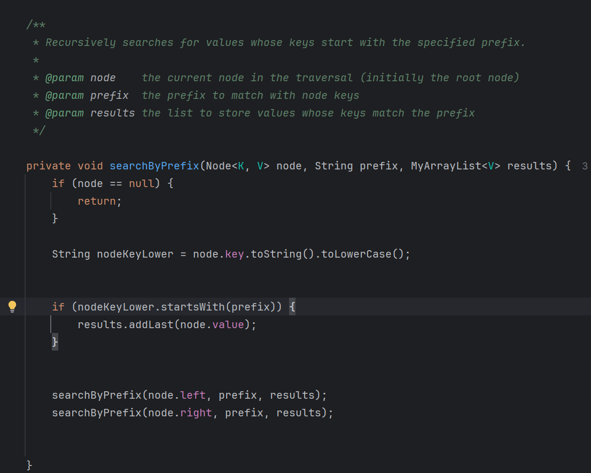

# Algorithms and classes

## My ArrayList

**Classification of time complexity for `MyArrayList` operations:**

- contains - `O(n)`

**Explanation of complexity:** The contains operation has linear time complexity, `O(n)`.
To determine if an element is present in the `MyArrayList`, it may need to traverse all elements,
especially if the element is at the end or not present at all.
If the element is located at the beginning or middle of the list, fewer elements are checked,
and traversal may end early.
But as complexity analysis mainly focuses on the worst-case scenario, which requires traversing the entire array.
Then the time complexity for the contains operation defined as O(n).

**Access operations:**

- get, set - `0(1)`

**Explanation of complexity:** Accessing operations by element index in methods like get and set has `O(1)` complexity.
This is because `MyArrayList` uses an array as underlying structure for implementation,
which allows random access to elements via their index.
This direct access eliminates the need to traverse elements,
enabling constant time complexity for both get and set operations.

**Remove and add operations:**

- add, remove - `O(n)`
- removeLast - `O(1)`

**Explanation of complexity:** Add and remove operations typically have a linear time complexity of `O(n)`
because inserting or removing an element at the beginning,
or a specific index requires shifting other elements in the array.However, adding an element to the end of the list has
a constant time complexity of `O(1)` in the best-case scenario, when there is enough capacity in the array.
However, since time complexity analysis typically focuses on the worst-case scenario, when resizing is needed, the
complexity becomes `O(n)` due to the need to copy elements into a larger array.The time complexity for removing the last
element is constant, `O(1)`, as it does not require any shifting of elements.

**Simple Sort operation:**

- simpleSort - O(n2)

**Explanation of complexity:** as `simpleSort` uses selection sort, which involves two loops.
The outer loop iterates over
all elements from start to end, giving `O(n)` complexity, while the inner loop iterates over the remaining part of the
array, also `O(n)`.
Together, this results in an overall time complexity of O(n2).

**Implementation of MyArrayList:**

**Implementation details:**
The most of `MyArrayList` implementation was provided by the teacher using the `SaxList` interface
and included in the project.
`MyArrayList` is a dynamic array-based list with an initial storage capacity of 32,
which doubles in size when capacity is reached, up to a maximum size of 256 elements.
`MyArrayList` includes operations for `adding`, `removing`, `searching`,
and `sorting`, as well as utility methods like `contains`, `isEmpty,` `size`, `checkAndExtendSize` and `graphViz`.
Detailed information for each method is stored in the JavaDoc comments within the `MyArrayList` file and `SaxList`
interface.

**Implementation:** [MyArrayList](../src/nl/saxion/cds/custom_data_structures/MyArrayList.java)

**How MyArrayList was tested:**

**Test details:** Most of the tests for `MyArrayList` were provided by the teacher and included in the project.
The tests cover both `good weather` scenarios, where operations function as expected, and `bad weather` scenarios,
ensuring that appropriate exceptions are thrown when necessary.
This verifies that the implementation functions as expected under various conditions.

**Tests:** [TestMyArrayList](../test/collection/TestMyArrayList.java)

## My DoublyLinkedList

**Classification of time complexity for `MyDoublyLinkedList` operations:**

- contains - `O(n)`

**Explanation of complexity:** The contains operation in `MyDoublyLinkedList` has the same time complexity as in
MyArrayList.
To determine if an element is present in `MyDoublyLinkedList`, the method may need to traverse all elements
from head to tail if the element is not present in the list or is located at the end.
Other reasoning is the same as in
the explanation for `MyArrayList`.

**Access operations:**

- get, set - `0(n)`

**Explanation of complexity:** Accessing elements by index in methods like get and set in a `MyDoublyLinkedList` has
`O(n)` complexity.
Since a DoublyLinkedList does not have random memory access, as ArrayList, the list must be traversed
starting from the head (or tail if closer) to reach a specific element by index, resulting in linear time complexity,
`O(n)`.

**Add and Remove operations:**

- add/remove in the beginning or end — `O(1)`

**Explanation of the complexity**: Removing or adding elements in the `MyDoublyLinkedList` has a constant time
complexity,
`O(1)`, because there is no need to shift other elements as required in an ArrayList.
Inserting or removing at the
beginning or end only requires updating the pointers in the head and tail nodes.

- add/remove - `O(n)`

**Explanation of the complexity:**
The time complexity for adding
or removing a specific element based on its value or index has linear time complexity,
`O(n)`.Unlike an ArrayList, a DoublyLinkedList does not need shifting elements to insert or remove at a specific index.
However,
it does need
to traverse the list to locate the specified index,either for inserting the element
or removing it and update the links between nodes,
resulting in a linear time complexity, `O(n)`.

**Implementation of MyDoublyLinkedList:**

**Implementation details:** The implementation of `MyDoublyLinkedList` was not copied from any external sources;
the topic of doubly linked lists, their structure,
and implementation was covered in the course *Data Structures and Algorithms*.
The `MyDoublyLinkedList` class utilizes the `SaxList` interface
and overrides its methods based on the doubly linked list structure.
It contains an inner class, `DLNode`,
which stores references to the previous and next nodes, as well as the node's value(including `null` values).
The decision to use an inner class rather than a separate class was made to avoid unnecessary getters and setters,
allowing quick access to necessary variables.
`MyDoublyLinkedList` provides basic operations such as `add`, `remove`, `get`, `set`, `isEmpty`, `size`, `graphViz`, and
more.
Additionally, it includes helper methods designed to optimize the code,
such as `insertBetween`, `getNodeAtSpecificIndex`, and `removeNode`.
JavaDoc documentation is provided for all additional methods and inner `DLNode` class in the `MyDoublyLinkedList` class,
documentation for the primary operations already presented in the `SaxList` interface.

**Implementation:** [MyDoublyLinkedList](../src/nl/saxion/cds/custom_data_structures/MyDoublyLinkedList.java)

**How MyDoublyLinkedList was tested:**

The `TestMyDoublyLinkedList` class contains various unit tests,
including tests for the state of the list using `size` and `isEmpty` methods,
tests for insertion at the beginning or end,
and removal at the beginning or end to verify that links to the head and tail are updated correctly.
It also includes tests for insertion at specific indices and removal by value or index,
ensuring that links are correctly established and elements are correctly removed or inserted.
Additionally, tests check the behavior of the `contains`, `set`, and `get` methods.
Special cases are included to check that `null` values can be added and removed correctly,
The tests also cover the behavior of iterator methods to ensure that elements are returned in the correct order.
The tests include "bad weather"
scenarios to confirm that exceptions in the `MyDoublyLinkedList` class are handled correctly.
Finally,
tests verify that the `graphViz` method produces the correct string representation for both empty and non-empty lists.

**Tests:** [TestMyDoublyLinkedList](../test/collection/TestMyDoublyLinkedList.java)

### My binary search algorithm

Classification: `O(Log(N))`

**Explanation of complexity:** Binary search has a time complexity of `O(log(N))`
because it repeatedly divides the sorted list in half until only one element remains.
Mathematically, this process of dividing N by two until reaching a single element can be expressed as `log₂(N)`.

This explanation was gotten from ChatGPT:

**Implementation of binary search**:

The binary search implementation in `MyArrayList` was gotten from a YouTube tutorial
(https://youtu.be/xrMppTpoqdw?si=NV5K_Dle0vP1AJtR)
but adapted to the structure of `binarySearch method` specified in `SaxSearchable interface`.
The method begins by verifying if the list is sorted using the `isSorted` method,
as binary search requires a sorted list to function correctly;
If the list is unsorted, it returns `SaxSearchable.NOT_FOUND` immediately to prevent incorrect results.

The search then initializes two pointers, `low` (set to 0) and `high` (set to `size - 1`), defining the search range.
A `while` loop runs as long as `low` is less than or equal to `high`,
ensuring that every element within the range is checked, this condition was specified in the video.
In each iteration, the middle index is calculated using formula from video :`middle = low + (high - low) / 2`,
The method then compares the target element with `get(middle)` using the provided comparator.
If the target matches `get(middle)`, it returns `middle` index, indicating the target is found.

If the target is greater than `get(middle)`, `low` is set to `middle + 1`,
eliminating the left half of the range; if the target is smaller, `high` is set to `middle - 1`,
eliminating the right half.

If the loop completes without finding the element, the method returns `SaxSearchable.NOT_FOUND`,
which has the value `-1`, the same as in video,
signifying that the element is absent.

My implementation uses `get` to access elements rather than direct array indexing in binary search method,
as was shown in the video.

**Explanation of `isSorted` method used in `binarySearch`:** The `isSorted` method checks if the list is sorted,
which is necessary for running the binary search.
Since `MyArrayList` allows null values,
this method includes additional logic for handling nulls additionally to standard comparisons of non-null elements.
It treats `null` as "smaller" than any non-null value,
allowing null elements to appear only at the beginning of a sorted list,
and returns `false` if any non-null value is placed before `null`.
For non-null elements,
it uses the provided `Comparator<V>`
to compare neighbor elements and returns `false` if any element is greater than the next.
If the list has zero or one element, it’s considered sorted,
so the method returns `true` in these cases.
The method includes JavaDoc and inline comments that clarify each check,
especially the handling of `null` values and the comparison logic.
If all checks pass, the method returns `true`, indicating the list is sorted; otherwise, it returns `false`.

**Implementation in `MyArrayList`:** [MyArrayList](../src/nl/saxion/cds/custom_data_structures/MyArrayList.java)

In `MyDoublyLinkedList`,
the `binarySearch` method is not implemented and instead throws an `UnsupportedOperationException`.
This is because binary search requires direct access to the middle element to compare it with the target element.
Unlike `ArrayList`, which supports random access, a doubly linked list does not provide this capability.
Accessing the middle element in a doubly linked list would require traversing from the head (or tail),
which removes the performance benefits of binary search.
As a result, binary search becomes inefficient in terms of time complexity on a linked list,
making it unsuitable for `MyDoublyLinkedList`.

**Implementation in `MyDoublyLinkedList`:
** [MyDoublyLinkedList](../src/nl/saxion/cds/custom_data_structures/MyDoublyLinkedList.java)

**How the binary search was tested:**

The test for binary search in `TestMyDoublyLinkedList` is designed
to verify that when binary search is called on a DoublyLinkedList,
it correctly throws an `UnsupportedOperationException`
to ensure that the binary search functionality is appropriately restricted.

Tests: [TestMyDoublyLinkedList](../test/collection/TestMyDoublyLinkedList.java)

The tests in `TestMyArrayList` include various cases to verify that the binary search works as intended.
First, they check that the correct index of an element is returned if the element is present in a sorted list.
They also verify that if the list is unsorted, the binary search method returns a `NOT_FOUND` value,
indicating that binary search cannot operate on an unsorted list.
Additionally, they ensure that if a sorted list does not contain the target element,
the method returns the `NOT_FOUND` constant from `SaxSearchable`.
For a list with a single element, the tests confirm that the correct index is returned if the element is present,
and `NOT_FOUND` is returned if the element is absent.
Similarly, they verify that `NOT_FOUND` is correctly returned for an empty list.
Most of these tests are performed on large data sets
because binary search is specifically designed to provide efficient search capabilities for extensive data sets.

Tests: [TestMyArrayList](../test/collection/TestMyArrayList.java)

### My linear search algorithm

Classification: `O(N)`

**Explanation of time complexity:**
The time complexity of linear search is `O(n)` because it checks each element in the list sequentially,
starting from the first element and comparing each one to the target element until it finds a match.
In the worst-case scenario, the target element might be located at the end of the list or may not be present at all,
requiring the search to go through all elements.
The time taken to perform this operation increases linearly with the number of elements in the list.

**Implementation in `MyArrayList`:**

The linear search in `MyArrayList` was implemented by the teacher.
It simply iterates over the `elements` array from the first to the last element,
comparing each current element with the item being searched for using the `equals` method.
If the item is found, it returns the index of the element; if the element is not found, it returns `-1`,
which is defined as `NOT_FOUND` in the `SaxSearchable` interface.

**Implementation in `MyDoublyLinkedList:`**

The linear search simply iterates over all elements stored in the list,
starting from the first node, which in the case of a `DoublyLinkedList` is the head node.
It then compares the value of the current node with the target value.
However, in `MyDoublyLinkedList`, element indexes are not handled automatically as they are in `MyArrayList`,
so the index must be manually incremented with each iteration.
Since this implementation of `DoublyLinkedList` allows null values,
the method also checks if the current element is null.
If both the current element and target element are null, it returns the index of the first null value found in the list.
Similar to the `MyArrayList` linear search,
this method returns the index of the found element or a `not found` value from the `SaxSearchable` interface
if the element does not exist in the list.

**How the linear search was tested:**

The test for `MyArrayList` linear search was provided by the teacher,
verifying that if an element is present in the list, its index will be returned;
if not, the `SaxSearchable.NOT_FOUND` value will be returned.

The tests for `MyDoublyLinkedList` include good weather tests
to ensure that the correct index of an element present in the list is returned,
that the index of a single null element is correctly returned,
and that the index of the first null element occurrence is returned
if the list contains multiple instances with null value.
Additionally, negative tests (bad weather tests)
are included
to confirm
that the method returns the `SaxSearchable.NOT_FOUND` value when the target element is not present in the list.

**Tests:**

[TestMyDoublyLinkedList](../test/collection/TestMyDoublyLinkedList.java)

[TestMyArrayList](../test/collection/TestMyArrayList.java)

### My QuickSort algorithm

**Classification of time complexity:**

- Average case - O( n log(n))
- Worst case - O(n2)

Complexity was gotten from article on `GeeksForGeeks` website:
https://www.geeksforgeeks.org/time-and-space-complexity-analysis-of-quick-sort/

**Explanation of complexity:** QuickSort has `O(n log(n))` complexity on average because it divides the array into two
roughly equal halves at each step.
Each level of recursion requires `O(n)` work to partition the array, and there are
about `log n` levels of recursion, resulting in a total time complexity of `O(n log(n))`.
In the worst case, QuickSort
becomes O(n2) when the pivot selection leads to severely unbalanced partitions (in case when the pivot is
always the smallest or the largest element).
Then this results in `n` levels of recursion instead of `log n`, making the
overall complexity O(n2).

**The explanation was based on ChatGPT's response:**

**Implementation details:** Most of the functionality for QuickSort,
including the `quickSort` methods (public and private) and the `swap` method, was implemented by the teacher.
The added implementation was for the `splitInPlace` method.

The understanding of how this method should be implemented was gotten from a YouTube video about quick sort
implementation (https://youtu.be/Vtckgz38QHs?si=-uTAGJkUQ7zXzazv) and an article on GeeksforGeeks about partitioning
schemes (https://www.geeksforgeeks.org/hoares-vs-lomuto-partition-scheme-quicksort/).
Initially, the `splitInPlace` method was provided in the project with use of the starting index (`begin`) as the pivot,
but as was suggested in the video, using the last index (`end`) as the pivot is a more standard approach in QuickSort.
This modification made it easier to follow the partitioning logic.
The code was not directly copied from either source.

Since the implementation of this method required the use of generics,
a `Comparator` was used to compare elements not by comparing it directly as was implemented in the video or the article.

Additionally, rather than following the single-pointer approach in the video,
the two-pointer technique from Hoare's partition scheme, as described in the GeeksforGeeks article, was used.

In the `splitInPlace` implementation, there are two pointers, `left` and `right`.
The `left` pointer starts at the beginning of the array (the `begin` index) and moves to the right,
stopping when it encounters an element greater than or equal to the pivot.
On the other hand, the `right` pointer starts at `end - 1` and moves to the left,
stopping when it encounters an element less than or equal to the pivot.
When both pointers stop, they have identified a pair of elements that are "out of order" relative to the pivot
(a larger element on the left side and a smaller element on the right side).
At this point,
these elements are swapped
to move them to the correct sides of the pivot.
This process repeats
until the `left` pointer meets or passes the `right` pointer.

When this happens,
the `left` pointer is now at the position where the pivot should be placed to correctly partition the array.
Partitioning is finalized by swapping the pivot (originally at the `end` index) with the element at the `left` pointer,
which ensures that all elements to the left of the pivot are smaller, and all elements to the right are larger.

After partitioning,
the quickSort method is recursively called on the two halves of the array
(elements before and after the pivot) to complete the sorting of both halves,
resulting in a fully sorted array.

**Implementation:** [MyArrayList](../src/nl/saxion/cds/custom_data_structures/MyArrayList.java)

**How the implementation of quick sort was tested:**

The teacher provided the tests for the quick sort in the `TestMyArrayList` file.

*Test file:* [TestMyArrayList](../test/collection/TestMyArrayList.java)

## My BST

**Classification of time complexity for BST operations:**

- add, remove - `O( log n)`, the worst case — `O(n)`
- search — `O(log n)`, the worst case — `O(n)`
- traversal - `O(n)`

**Explanation of the time complexity:**
In a relatively balanced by chance binary search tree, the insertion, deletion,
and search operations generally take `O(log n)` time.

This is because locating the appropriate position for insertion, retrieval,
or removal requires traversing the tree from the root to the correct node,
with the number of comparisons equaling the height of the tree,
which is approximately `log n` in a mostly balanced structure.

However, if the tree is not self-balanced,
this advantage could be lost because the tree may take on a linked list-like structure,
causing the time complexity for these operations to increase to `O(n)`.

Tree traversal operations (such as in-order, pre-order, or post-order traversal)
have a time complexity of `O(n)` in both average and worst cases,
as every node in the tree needs to be visited, regardless of the traversal type.

**The complexity information was gotten from the chatGPT:**

**Implementation details:**

The implementation of `MyBinarySearchTree` is based on the SaxBinaryTree interface,
with most of the basic operations retrieved from the source code of a
YouTube [video](https://youtu.be/zIX3zQP0khM?si=ZIkDHRgYqP231-qi) by Geekific with the source
code [here](https://github.com/geekific-official/geekific-youtube/blob/main/tree-implementations/bst-binary-search-tree/src/main/java/com/youtube/geekific/BinarySearchTree.java)
and general knowledge from a `Data Structures and Algorithms` course.

The recursive operations, such as `add` and `remove`,
follow the source code's logic with slight modifications to adapt the structure to the provided interface.
However, the remove method uses a slightly different approach:
in the source code, removing a node with two children involves finding the `in-order predecessor`
(the largest node in the left subtree).
In contrast,
my implementation uses the `in-order successor` (the smallest element in the right subtree) for nodes with two children.
All other aspects of the remove logic align with the source code,
and the logic for retrieving the `in-order successor` is also derived from the source.

As discussed in class, there are two possible ways to implement a binary search tree: (1) using an inner `Node` class,
where each node stores pointers to its left and right children, as well as its data, or (2) using a recursive structure
where each tree instance contains its own left and right subtrees.
Both approaches can be used,however, the recursive tree structure is generally less intuitive to implement,
harder to maintain, and less flexible for extension.

Since this binary search tree class will be used as a superclass for an `AVL tree`,
the decision was made to use an inner Node class.

The logic for the `inOrder` traversal method and the `search` method is based on knowledge
gained from the `Data Structures and Algorithms` course.

Additionally, the `MyBinarySearchTree` class includes two specialized methods,
used in actual application, `getByPrefix` and `searchByPrefix`,
which are not fully generic as they are specifically designed for prefix-based searches.
The `getByPrefix` method initiates the search for keys
that start with a specified prefix by calling the private helper method `searchByPrefix`.
This helper method recursively traverses both the left and right subtrees of each node to find all potential matches.
Unlike a typical search in a binary search tree,
no conditions are imposed to restrict the traversal solely to the left or right subtree,
as this could lead to an incomplete set of results.
During traversal, each node's key is compared (in lowercase form) with the prefix,
and if it starts with the prefix, the node’s value is added to the result list.

These methods were introduced in this class
to avoid exposing the internal structure of the binary search tree to application-related classes.
Since the basic get method is not suitable for partial or prefix-based searches,
it was decided to add these specialized methods.

Each method in the MyBinarySearchTree class is documented with JavaDoc comments for clarity.

**Implementation:** [MyBinarySearchTree](../src/nl/saxion/cds/custom_data_structures/MyBinarySearchTree.java)

**How the `MyBinarySearchTree` was tested:**

The `TestMyBST` unit tests ensure that `MyBinarySearchTree` operates as expected across various scenarios.
Core operations like adding, removing, and retrieving elements are tested,
along with `size` and `isEmpty` checks to confirm that the tree’s internal state is reflected correctly.
Insertion tests confirm that unique keys are added correctly, the size updated correctly,
while duplicate keys trigger a `DuplicateKeyException`.
Removal tests handle nodes with zero, one, or two children,
verifying the correct use of in-order successor replacement for nodes with two children.
Edge cases for removal and retrieval also tested
to ensure the `KeyNotFoundException` is thrown during the retrieval or deletion of non-existent keys.

Tests for `getByPrefix` validate additional prefix-based search,
ensuring it retrieves all matching elements and handles cases with multiple, single, or no matches.

The `graphViz` method is tested for accurate GraphViz DOT format generation, including empty, simple,
and complex tree states.

**Tests:**[TestMyBST](../test/collection/TestMyBST.java)

## My AVL BST

**Classification of time complexity for AVL BST operations:**

- add, remove - `O( log n)`
- search — `O(log n)`
- traversal - `O(n)`

**Explanation for time complexity:**

In a balanced binary search tree, the time complexity for the insert,
delete, and search operations is `O(log n)` for the average and worst cases.
Since an AVL tree is self-balancing,
it maintains this time complexity by rebalancing itself after each insertion and deletion,
preventing the tree from degrading into a linked-list-like structure.
This ensures that the time complexity does not increase to O(n) due to imbalances.
The reasoning for traversal operations remains the same as in `MyBinarySearchTree`,
where each type of traversal—whether in-order, pre-order, or post-order—has a time complexity of O(n).

**Implementation details:**

The `MyAVLBinarySearchTree` class extends the `MyBinarySearchTree` class,
overriding the `insert` and `delete` methods to implement rotations,
includes balance factor calculation, and height update.
The understanding of rotation implementation was retrieved from a YouTube
video(https://youtu.be/Jj9Mit24CWk?si=9zQq7I1BWzkZ9c8_),
with source code
available [here](https://github.com/geekific-official/geekific-youtube/blob/main/tree-implementations/avl-tree/src/main/java/com/youtube/geekific/AVLTree.java).

The `updateHeight` method's logic was also adapted from this source code;
it calculates the height by taking the maximum height of the left and right subtrees and adding one.

This method uses the `height` helper method, which was copied from the source code.
The `height` method calculates the height of a given node and returns zero if the node is null.

The logic for right and left rotations was also copied directly from the source code.

The conditions for the `balance` method,
which performs tree balancing, were taken from [this website](https://www.happycoders.eu/algorithms/avl-tree-java/).

As explained in the video,
the `insert` and `delete` operations in an AVL tree are similar to those in a regular binary search tree,
but with additional `balance` and `updateHeight` operations.
Therefore, `MyAVLBinarySearchTree`
calls the `insert` and `delete` method from its parent class and then applies balancing and height updates.

The calculation of the balance factor was also adapted from the source code in the video.

Each method in the MyAVLBinarySearchTree class is documented with JavaDoc comments for clarity.

**Implementation:** [MyAVLBinarySearchTree](../src/nl/saxion/cds/custom_data_structures/MyAVLBinarySearchTree.java)

**How the `MyAVLBinarySearchTree` was tested:**

The `TestMyAVLBST` unit tests provide validation for insertion and removal operations,
ensuring that self-balancing is performed correctly.
The insertion tests cover all rotation cases to ensure the AVL tree balances them correctly: single rotations are
verified through Left-Left (LL) and Right-Right (RR) scenarios , while double rotations are tested with Left-Right (LR)
and Right-Left (RL) scenarios to address complex imbalances.
Deletion tests further confirm that the AVL tree rebalances itself correctly in all rotation cases during node removal.
Additionally,
balance factor tests are included
to verify that the balance factor is calculated correctly for an empty tree and for different types of imbalances,
such as left or right-heavy cases.
Finally,
exception handling is tested to ensure that inserting a duplicate key throws a `DuplicateKeyException`
and that accessing or deleting a non-existent key throws a `KeyNotFoundException`.

**Tests:** [TestMyAVLBST](../test/collection/TestMyAVLBST.java)

## My HashMap

**Classification of time complexity for the MyHashMap operations:**

- add — `O(1)` or `O(n)` for the worst case
- get — `O(1)` or `O(n)` for the worst case
- remove — `O(1)` or `O(n)` for the worst case
- contains — `O(1)` or `O(n)` for the worst case
- resize - `O(n)`
- getKeys - `O(n)`

**Explanation of time complexity for operations:**

Usually, the time complexity for adding an element to a hashmap is constant, `O(1)`.
However,
in the case of a collision—when multiple elements are placed in the same bucket—the time
to traverse the list of stored values
and place the new element at the end of this list increases the time complexity to `O(n)`,
where `n` represents the number of elements in that specific bucket.
The same logic applies to the `get`, `remove`, and `contains` methods.
If there are no collisions, these operations take constant time to retrieve or remove a specified key.
However, in cases of collisions, they may need to traverse the entire list of elements in the bucket.

For the `getKeys` and `resize` operations, the time complexity is `O(n)`.
Collecting all keys requires iterating over each bucket and traversing all entries in that bucket to gather the keys.
Similarly, resizing the hashmap and rehashing all elements in the new, larger table takes `O(n)` time,
where `n` is the total number of entries.

The time complexity for the `HashMap` operations was gotten from the response of chatGPT:

**Implementation details:**
The `MyHashMap` implementation based on the `SaxHashMap` interface and was not directly copied from any specific
sources; however, the understanding and ideas for its implementation were gotten from a YouTube video explaining hash
table implementation (https://youtu.be/FsfRsGFHuv4?si=PX_IP9gxnkM1FTC-). To store data in `MyHashMap`, an inner class
`Entry<K,V>` was created to represent a key-value pair, which is the fundamental representation of element of the hash
map.
The hash table itself is implemented using an array of `MyDoublyLinkedList` objects,
representing the internal structure of the hash map.

The `MyDoublyLinkedList` structure was chosen to effective collision handling:
when multiple elements hash to the same bucket index, they are chained together in a linked list at that index.
This avoids overwriting existing entries in the same bucket.
The decision to use an array of doubly linked lists,
rather than an array of array lists, was made due to more efficient memory allocation,
as a doubly linked list only allocates memory for actual elements and does not maintain empty slots,
unlike an array list with a fixed internal array.

The `load factor`,
which determines when the hash table should resize, was gotten from `Java’s HashMap` implementation and set to 0.75.
This means that when the hash table is filled to 75% of its capacity,
it automatically resizes by doubling its current capacity,
starting from an initial capacity of 16, which was also adapted from `Java's Hashmap` implementation.
The `resize method` handles this process: it copies the data from the original table,
and creates a new table with doubled capacity, rehashing all entries into the new table.

The formula for calculating the bucket index was adapted from the video.
To compute the index,
the `MyHashMap` retrieves the hash code of the key
and performs a modulo operation with the table's capacity to determine the bucket index.
All basic operations—such as adding, removing, checking for specific elements,
and retrieving values by key uses the `getBucketIndex` method and, when necessary, the `resize` method.
For remove, get,
and contains, the `getBucketIndex` method is used to locate the appropriate bucket,
then the code iterates over the doubly linked list in that bucket to find the target entry.
The add method inserts an element at the specific bucket index and checks if the load factor threshold has been reached;
if so, it triggers resizing, otherwise the table remains as it is.

Additional methods provided in `MyHashMap` include size to get the current number of entries,
`isEmpty` to check if the map has no entries, `graphViz` for visualization,
and `getKeys` to retrieve all keys in the hash map.

Each method in the MyHashMap class is documented with JavaDoc comments for clarity.

The values for load factor and initial capacity are retrieved from the Java Hashmap source code:
https://github.com/openjdk/jdk/blob/master/src/java.base/share/classes/java/util/HashMap.java

**Implementation:** [MyHashMap](../src/nl/saxion/cds/custom_data_structures/MyHashMap.java)

**How the `MyHashMap` implementation was tested:**

The unit tests in `TestMyHashMap` include various cases to ensure that the data structure functions as expected.
Core functionalities such as adding, removing,
and retrieving elements are tested,
along with checks for the `size` and `isEmpty` methods to verify that the map accurately reflects its state.
The tests also include scenarios that provoke collisions to ensure that `MyHashMap` correctly handles these cases.
Additionally,
tests verify that the map resizes correctly after reaching the load factor
and that all stored values are rehashed in the resized table.
The `graphViz` method is tested to ensure it produces the correct string representation.
The private `getBucketIndex` method is tested
using reflection to verify that the bucket index is calculated correctly based on the map’s capacity.
Finally, the tests include "bad weather"
cases to ensure that the class throws the appropriate exceptions in corresponding situations.

**Tests:** [TestMyHashMap](../test/collection/TestMyHashMap.java)

## My MinHeap

**Time complexity for the `MinHeap` operations:**

- enqueue, dequeue - `O(log n)`
- peek - `O(1)`

**The time complexity definitions were retrieved from this website:
** https://www.geeksforgeeks.org/complexity-analysis-of-various-operations-of-binary-min-heap/

**Time complexity explanation:**
In a min-heap is represented as a complete binary tree, the insertion and deletion operations take `O(log n)`
time because they involve moving elements up or down to maintain the heap structure.
Since the height of the tree is `log n`, it takes about `log n` swaps to reach the correct position.

The `peek` operation, which retrieves the minimum element, has constant time complexity, `O(1)`,
because the smallest element is always placed at the root of the heap (the first element in the array).

**Implementation details:**

The `MyMinHeap` class is an array-based structure,
which uses the `MyArrayList` as the underlying structure for storing elements.
The min heap represents a complete binary tree filled from left to right without any gaps,
where each parent node is less than or equal to its children.

The `MyMinHeap` class is self-implemented without any external code sources and is based on the SaxHeap interface.
It provides basic heap operations, including enqueue for inserting elements,
dequeue for removing the smallest element (the root),
and peek for retrieving the smallest element.

To maintain the min-heap property during insertion and removal,
additional methods such as `percolateUp` and `percolateDown` are implemented.
The `percolateUp` method is called after inserting a new element at the end of the array list.
It recursively compares the inserted element with its parent, swapping them if the child is smaller than the parent,
and continues moving up the tree until the heap property is restored.
This process either reaches the root of the heap or stops when the parent element is smaller than or equal to the child.

The `percolateDown` method is used after removing the root element during a `dequeue` operation.
In this operation, the last element in the array list is moved to the root position,
and `percolateDown` used to restore the heap property.
Initially, the smallest child is assumed to be the left child because the heap is filled from left to right,
so if there's only one child, it will be the left.
If a right child exists and is smaller, it becomes the smallest child.
This child is then compared to the current element, and they are swapped if the current element is larger.
This process continues recursively until reaching a leaf
or the current element is smaller than both children.

Additional helper methods, such as `getParentIndex`, `getLeftChildIndex`, and `getRightChildIndex`,
are used in the `percolateUp` and `percolateDown` methods
to calculate the index positions of a node’s parent and children in the array list.

The formulas for these calculations were gotten from lecture sheets covering heap theory.

Each method in the `MyMinHeap` class includes JavaDoc comments for clarity.

**Implementation:** [MyMinHeap](../src/nl/saxion/cds/custom_data_structures/MyMinHeap.java)

**How the `MinHeap` implementation was tested:**

The `TestMyMinHeap` unit tests validate the core functionalities of the `MyMinHeap` class.
Basic operations like insertion (`enqueue`), removal (`dequeue`),
and peeking (`peek`) are tested to ensure correct behavior and that the heap property is maintained correctly.
The tests also include validation of the `graphViz` output
to ensure that correct string graph DOT of the heap structure in various cases is returned.
Edge cases where operations are attempted on an empty heap are tested
to confirm that an `EmptyCollectionException` is thrown correctly.
Additionally,
reflection-based tests verify
that private methods throw an `IllegalArgumentException` for invalid indices when retrieving parent or child indices.

**Tests:** [TestMyMinHeap](../test/collection/TestMyMinHeap.java)

## My Stack

**Classification of time complexity for the `MyStack` operations:**

- push — O(1)
- pop - O(1)
- peek - O(1)

**Explanation of complexity:** All these operations interact with the last element of the stack.
The `push` operation adds a new element as the last element, `pop`
removes the last element, and `peek` retrieves the last element.
Each of these operations has a constant time complexity of O(1),
as they only involve updating or accessing the end of the stack.

**Time complexity for the stack was gotten from this website:
** https://www.geeksforgeeks.org/time-and-space-complexity-analysis-of-stack-operations/

**Implementation details:**
The `MyStack` class was self-developed based on the provided  `SaxStack` interface,
with no code copied from external sources.
The understanding of its structure and implementation was obtained through lecture dedicated to this topic.
As was discussed in class, a stack can be implemented using two underlying structures:
an `MyArrayList` or a `MyDoublyLinkedList`.

In this implementation,
a `MyDoublyLinkedList` was chosen due to the inefficiencies associated with using an `MyArrayList` for a stack.
Specifically,
the fixed capacity of an array-based structure means
that it may require resizing during `push` operations once capacity is reached,
which can increase the initial time complexity from `O(1)` to `O(n)`.

In contrast, a `DoublyLinkedList` allows constant time complexity `O(1)`
for both `push` and `pop` operations, as it only involves updating node links without resizing.
Furthermore, since stack operations follow the Last-In-First-Out (LIFO) principle,
a `MyDoublyLinkedList` does not increase the time complexity for `peek` and `pop` operations,
even without random access,
as retrieving the top element (the last node) does not require traversal and maintains constant time complexity.

Finally, a linked list allocates memory only for nodes currently in the list,
unlike an `MyArrayList`, which pre-allocates extra space,
leading to potentially inefficient memory usage due to unused slots.
Each method in the `MyStack` class is provided by JavaDoc comments for clarity.

**Implementation:** [MyStack](../src/nl/saxion/cds/custom_data_structures/MyStack.java)

**How the implementation of `MyStack` was tested:**

The tests cover "good weather" scenarios to confirm that stack operations such as `pop`,
`peek`,
and `push` behave as expected after each modification made in the tests and the size of the stack updated correctly.
Additionally, "bad weather"
scenarios are tested
to ensure that all exceptions in the `MyStack` class are thrown correctly in the corresponding situations.
The `graphViz` method is also tested to ensure it produces the correct string representation for both
an empty stack and a stack containing elements.

**Tests:** [TestMyStack](../test/collection/TestMyStack.java)

## My Queue

**Classification of time complexity for the `MyQueue` operations:**

- enqueue — O(1)
- dequeue - O(1)
- peek - O(1)

**Explanation of complexity:** The reasoning for the time complexity of the `enqueue`, `dequeue`,
and `peek` operations in the `MyQueue` class is the same as for `MyStack` operations.
The main difference lies in which element the data structure interacts with.
In the case of the `queue` data structure, it interacts with the both first and last element, not only with the last,
at it was in `stack` data structure.

**Time complexity for the stack was gotten from this website:
** https://www.geeksforgeeks.org/time-and-space-complexity-analysis-of-queue-operations/

**Implementation details**:
The `MyQueue` class also was self-developed based on the provided `SaxQueue` interface,
with no code copied from external sources.
The understanding of its structure and implementation was obtained through a lecture dedicated to this topic.
Like a stack, the queue can be implemented using two underlying structures: an `MyArrayList` or a `MyDoublyLinkedList`.

In this implementation, `MyDoublyLinkedList`
was chosen due to the inefficiencies associated with using `MyArrayList` for a queue.

Queue operations follow the `FIFO (First In, First Out)` structure:
when an element is `enqueued`, it is added as the last element,
and when `dequeued`, the first element in the list is removed.
Using an `ArrayList` as the underlying structure would degrade performance even more for a queue
than it does for a stack.

In a stack, performance is mainly impacted during push operations when the underlying array may need to be resized.
However, in a queue, performance decreases for both `enqueue` and `dequeue` operations.
For enqueue operations, the underlying array might need to be resized if it reaches capacity,
which incurs an `O(n)` complexity as elements are copied to a new array.
For `dequeue` operations,
removing the first element from an `ArrayList` requires shifting all remaining elements to the left,
resulting in `O(n)` complexity.

By contrast,
a `DoublyLinkedList` has constant time complexity `O(1)` for both adding the last element
(enqueue) and removing the first element
(dequeue).

This efficiency arises
because a doubly linked list only updates the head and tail pointers when elements are added or removed,
without requiring any shifting of elements.

The reasoning for the `peek` operation and memory allocation remains the same as for the stack implementation.
However, in a queue, the `peek` method returns the first element, not the last.

Each method in the `MyQueue` class includes JavaDoc comments for clarity.

**Implementation:** [MyQueue](../src/nl/saxion/cds/custom_data_structures/MyQueue.java)

**How the implementation of `MyQueue` was tested:**

The tests for the `MyQueue` class were performed in a similar manner to tests for the `MyStack` class.
Good weather tests were included for all main operations to verify that the implementation behaves correctly.
Additionally,
bad weather tests were used to ensure that all exceptions defined in the class are thrown in the appropriate situations.
The tests for the `graphViz` method followed the same testing approach as in the `MyStack` tests,
ensuring it produces the correct string representation for both empty and non-empty queues.

**Tests:** [TestMyQueue](../test/collection/TestMyQueue.java)

## My Graph

**Implementation:** [MyGraph](../src/nl/saxion/cds/custom_data_structures/MyGraph.java)

**Implementation details:**

In the course material,
it was mentioned that a graph could be implemented using either an `adjacency matrix` or an `adjacency list`.

For the `MyGraph` implementation, an adjacency list was chosen over an adjacency matrix due to its memory efficiency.
An adjacency matrix stores a `1` for each pair of vertices that has an edge and a `0` for pairs without an edge.
This can be inefficient in terms of memory usage,
especially for large graphs with many vertices but relatively few edges,
as it requires `O(V^2)` space regardless of the actual number of edges.

In contrast, an adjacency list only stores the edges that exist, so it has space complexity of `O(V+E)`,
making it significantly more memory-efficient for sparse graphs where most pairs of vertices are not directly connected.
To implement the adjacency list, a `MyHashMap` was used, where each vertex maps to a list of its connected edges.
This hashmap-based structure enables fast lookups for vertices.

Space complexity for the `adjacency list` and `adjacency matrix` was retrieved from this website:
https://www.geeksforgeeks.org/comparison-between-adjacency-list-and-adjacency-matrix-representation-of-graph/

The `MyArrayList` was used to store the edges associated with each vertex,
rather than a structure like `MyDoublyLinkedList`.
This choice was made because `MyArrayList` provides efficient access by index,
which is ideal for managing edge lists where edges rarely need to be removed,
so the advantages of a doubly linked list, such as more efficient removal, which not require shifting, were unnecessary.

The `MyGraph` class was implemented based on the `SaxGraph` interface,
which defines the basic operations for a graph data structure.
Each method in `MyGraph` aligns with the interface,
implementing operations like `addEdge`, `addEdgeBidirectional`, `getEdges`, `getTotalWeight`.
Since the `SaxGraph` interface already includes detailed JavaDoc for these basic operations,
additional documentation was not added within `MyGraph` for these methods.

**Tests:** [TestMyGraph](../test/collection/TestMyGraph.java)

The tests in `TestMyGraph` cover fundamental graph operations to ensure that they handled correctly.
For edge creation,
tests verify
that `addEdge` and `addEdgeBidirectiona`l properly set up directed and bidirectional edges between vertices.
The `getEdges` method is tested to confirm it returns the correct edges for each vertex,
and an exception is thrown for non-existent vertices, ensuring covering of bad weather tests.
Additionally, `getTotalWeight` is tested to confirm it accurately computes the total weight of all edges in the graph.
Furthermore, tests check `isEmpty` method to ensure that the graph reflects it's state correctly.
The `graphViz` method is also tested to ensure that it correctly displays the string representation of the graph.

### My iterative depth first search algorithms

**Classification:** `O(V + E)`

**Time complexity explanation:**

In DFS time complexity, `V` is the number of vertices, and `E` is the total number of edges in the graph.
The complexity `O(V + E)` comes from visiting each vertex once (V) and traversing each edge once (E).

**Classification retrieved from this website:
** https://www.geeksforgeeks.org/time-and-space-complexity-of-depth-first-search-dfs/

**Implementation:** [MyGraph](../src/nl/saxion/cds/custom_data_structures/MyGraph.java)

**Implementation details:**
The `MyGraph` class implements a depth-first search (DFS) traversal using a custom DFS iterator.
This iterator is developed according to the DFS pseudocode from graph theory lectures,
utilizing `MyStack` for stack functionality and `MyHashMap` for set functionality to track visited nodes,
ensuring each vertex is processed only once.
The traversal begins by pushing the first node in the adjacency list onto the stack,
then enters a loop that continues until the stack is empty.
In each iteration, the iterator pops the top element (`next`) from the stack;
if it hasn't been visited, it is marked as visited.
The iterator then retrieves all neighbors of `next` from the adjacency list,
pushing unvisited neighbors onto the stack for future processing.
Once all neighbors of `next` have been processed, `next` is returned.
This stack-based approach enables the algorithm
to reach the deepest element before backtracking—when a node with no unvisited neighbors is reached,
the iterator backtracks by popping nodes until it finds one with unvisited neighbors.
The traversal completes once the stack is empty, meaning all reachable nodes have been visited.

Implementation of the `DFS iterator` includes JavaDoc comments for clarity.

**Pseudocode, using which the algorithm was implemented**

**Tests:** [TestMyGraph](../test/collection/TestMyGraph.java)

The `DFS` iterator in `MyGraph` was tested
by creating a sample graph and verifying the traversal order.
The test checked that nodes were visited in the correct depth-first sequence.
An additional test confirmed that the iterator returns `null` for an empty graph.

### My Dijkstra algorithm

**Classification:**  `O((V + E) log V)` with use of priority queue

**Explanation of time complexity:**

The time complexity of Dijkstra's algorithm with a priority queue is `O((V + E) log V)`,
resulting from two main operations.
Processing each vertex in the priority queue takes `O(V log V)` time, as each vertex requires insertion and extraction.
Additionally, processing each edge to update the minimum distance takes `O(E log V)` time.
Together, these operations result to an overall complexity of `O((V + E) log V)`.

**The time complexity of Dijkstra algorithm was retrieved from this website:
** https://www.geeksforgeeks.org/time-and-space-complexity-of-dijkstras-algorithm/

**Implementation:** [MyGraph](../src/nl/saxion/cds/custom_data_structures/MyGraph.java)

**Implementation details:**

The `shortestPathsDijkstra` method in `MyGraph` implements Dijkstra's algorithm
to find the shortest paths from a given start node to each reachable node.
This implementation follows the pseudocode from the course material.
The method initializes a result graph to store shortest paths,
a `MyHashmap` to function as a set for storing visited nodes,
and a priority queue (`MyMinHeap`) to manage edges based on cumulative path weights.
The start node is enqueued as an edge pointing to itself with weight 0. In each iteration, the algorithm dequeues the
minimum-weight edge, checks if the `from` node has been visited, and, if not, marks it as visited and adds the edge to
the result graph (excluding the initial self-loop).
For each unvisited neighbor, it enqueues a new reversed edge to support backtracking,
with the updated cumulative weight,
continuing this process until all reachable nodes are visited.

The `backTrackDijkstra` helper method is implemented
to retrieve the shortest path between the start node and a specified goal node
using the result graph generated by `shortestPathsDijkstra`.
It backtracks from the goal node to the start node by following the edges in the result graph.
For each node,
it retrieves the edge leading to the previous node
and adds it to the path list in reverse order to construct the correct path sequence.
If a node on the path is unreachable, the method throws an `IllegalStateException`.

Implementation of the `shortestPathsDijkstra` and `backTrackDijkstra` includes JavaDoc comments for clarity.

**Pseudocode, using which the algorithm was implemented:**

**Tests:** [TestMyGraph](../test/collection/TestMyGraph.java)

Tests for the Dijkstra algorithm were implemented using examples provided in the course materials.
The tests cover both scenarios:
one where backtracking is possible because the goal node is reachable from the start node,
and another where backtracking is impossible because there is no path connecting the goal node to the start node.
These tests ensure that the algorithm correctly identifies reachable paths
and appropriately handles cases where no path exists.

**Test case from sheets for Dijkstra algorithm:**

### My A* algorithm

**Classification:** `O(|E| log |V| )`

**Explanation of time complexity:** The time complexity of A* with a priority queue is `O(|E| log |V|)`, where `|E|` is
the number of edges and `|V|` is the number of vertices.
Managing nodes in the priority queue requires `O(log |V|)` time
per operation, as the queue keeps nodes ordered by their `f` values (estimated total cost).
Therefore, processing all
edges with logarithmic operations on the queue results in a total complexity of `O(|E| log |V|)`.

**The time complexity of A star algorithm was retrieved from this Wikipedia:
** [AStarComplexity](https://en.wikipedia.org/wiki/A*_search_algorithm)

**Implementation:** [MyGraph](../src/nl/saxion/cds/custom_data_structures/MyGraph.java)

**Implementation details:**

The `shortestPathAStar` method,
which implements the A* algorithm in the `MyGraph` class,
was implemented according to the pseudocode provided in the course material.
This method uses a custom node structure, `AStarNode`, and a custom `reconstructPath` method,
as specified in the pseudocode.
The understanding
of how to implement the `AStarNode` class
and what data should be stored inside it was gotten from the theoretical video on YouTube
that explains the functioning of the A* algorithm
([Introduction to A* Algorithm by Computerphile](https://youtu.be/eSOJ3ARN5FM?si=Nwy20PRLqlJPt6JO)).
The `AStarNode` class stores essential information, needed for the algorithm, including the edge to its predecessor, the
value of the current vertex (node), a reference to the parent node, the actual cost `g` from the start node to this
node, the heuristic cost `h` from this node to the goal node, and the `f` value (the sum of `g` and `h`) used to
prioritize nodes in the A* algorithm.
This inner class implements the `Comparable` interface, allowing nodes to be compared based on their `f` values.
The `reconstructPath` method then uses the `edgeToNode` and `previousVertex` references in each
`AStarNode` to reconstruct the path from the goal node back to the start node.

Implementation of the `shortestPathAStar`, `reconstructPath`
and the inner class `AStarNode` includes JavaDoc comments for clarity.

**Pseudocode, using which the algorithm was implemented:**

**Tests:** [TestMyGraph](../test/collection/TestMyGraph.java)

The implementation of the `shortestPathAStar` method was tested
using the `Coordinate` class to represent the coordinates of cities in the Netherlands.
The latitude and longitude of these cities were retrieved from online sources,
and the `haversineDistance` method in the `Coordinate` class was used as the heuristic function for the A* algorithm,
estimating the distance between nodes based on geographical coordinates.

The unit tests cover both cases: when the goal is reachable from the start and when it is not.
If the goal is reachable,
the test verifies that the A* algorithm returns the correct path and that the shortest path is chosen.
If the goal is not reachable from the start, the method correctly returns `null`.

### My MCST algorithm

**Classification:** `O(|E| + |V| log |V|)`

**Explanation of time complexity:**

The time complexity of Prim's algorithm is `O(|E| + |V| log |V|)`
is based on how the edges and vertices are processed.
Each vertex is added to a priority queue (MinHeap), where insertion and removal operations take `O(log |V|)` time.
Since there are `|V|` vertices, this part of the algorithm contributes `O(|V| log |V|)`
to the overall complexity.
Additionally, each edge is considered once when exploring the neighbors of added vertices,
which adds `O(|E|)`.
So it results in the provided time complexity.

**The time complexity of Prim MCST algorithm was retrieved from this course material slide:**

**Implementation:** [MyGraph](../src/nl/saxion/cds/custom_data_structures/MyGraph.java)

**Implementation details:**

The `minimumCostSpanningTree` method in `MyGraph` provides the implementation for the Minimum Cost Spanning Tree
(MCST) using Prim’s algorithm.
Prim’s algorithm was chosen for this implementation due to its similarity to Dijkstra’s algorithm,
which made it easier to adapt the existing structure of Dijkstra’s algorithm without an additional pseudocode from the
course material for the MCST.
Additionally, Prim’s algorithm is generally simpler to implement than Kruskal’s algorithm,
as Kruskal’s approach requires more complex steps to avoid cycles.

Starting from an arbitrary vertex (in case of this implementation the first vertex in the graph),
the algorithm builds the MCST
by repeatedly adding the smallest edge that connects a vertex in the tree to a vertex outside it.
A `MyMinHeap` is used to select the smallest edge from added,
and a `MyHashMap` keeps track of which vertices have already been added to the tree,
ensuring that no cycles are created.
For each new vertex added, all its outgoing edges are examined,
and any edges leading to unvisited vertices are added to the priority queue.
This process ensures that the tree includes the minimum possible edge weight at each step,
resulting in a new graph that represents the MCST for the connected component that includes the starting vertex.

Implementation of the `minimumCostSpanningTree` includes JavaDoc and comments for clarity.

**Tests:** [TestMyGraph](../test/collection/TestMyGraph.java)

The Prim's algorithm implementation was tested in `TestMyGraph`
using a simple graph and an example from the course materials
to verify that it produces the correct Minimum Cost Spanning Tree
(MCST),
with the expected edges and accurate total weight.

**The test case from sheets:**

# Technical design My Application

## Class diagram and reading the data

**Classes:**

**Application:**
  The Application class serves as the user interface for interacting with the railway network.
  It provides a console-based menu with the following options:
- Search Stations by Name, Code, and Type: Users can look up stations by code, full or partial name, or station type.
- Retrieve Shortest Path: Finds the shortest path between two specified by user stations,
  displaying the route and total distance.
- Display Minimum Cost Spanning Tree (MCST): Displays the MCST for either all stations or only Netherlands-based
  stations with total length and total distance.

The Application class relies on the TrackManager class for processing of user requests and handles user inputs.

**TrackManager:**

The TrackManager class is responsible for managing and processing data related to stations and tracks:

- Data loading: Reads station and track data from CSV files using `LambdaReader`.
- Custom data structure usage: The TrackManager uses custom data structures like MyArrayList, MyHashMap, and MyGraph, MyAVLBinarySearchTree for user requests processing.
- Graph creation: Creates graphs representing the railway network for the shortest path and MCST retrieval.
- Station/stations searching: Provides methods to retrieve station or stations` information based on code, name, or type, including prefix-based name search.
- Pathfinding and MCST creation: Uses Dijkstra's algorithm for shortest path finding and Prim's algorithm for MCST generation.

The `TrackManager` class also includes methods to filter the station list to only include stations in the Netherlands,
enabling the generation of an MCST specifically for the Dutch rail network.
Additionally, it has a helper method for graph creation that checks if a track is bidirectional,
a `capitalize` method for producing more readable output,
and supporting structures like `codeToNameMap` to provide user-friendly output when displaying the shortest path.

**Track and Station classes:**

The `Track` and `Station` classes are implemented based on the provided CSV data files.
They contain no specific methods, except the `getFullCountryName` method in the `Station` class,
which provides a more user-friendly output in the toString method.
This output is then used to display information to the user.

**Reading data:**

The data reading classes, `CSVReader` and `LambdaReader`, are designed to read CSV files.

These class implementations were part of the Software Development Principles (SDP) course,
covering the concept of a generic CSV reader.
The code was copied from last year's SDP exercises.

- **CSVReader**: This class reads CSV files line-by-line, splitting each line into columns based on a specified delimiter. It supports skipping headers if needed and provides a method to close the resources safely.

- **LambdaReader**: Extending `CSVReader`, `LambdaReader` uses a `Creator` interface to transform each line into a specific object type `T`. This allows dynamic object creation from CSV data, making it highly reusable and adaptable for different data types.

These classes are used for loading station and track data into the `TrackManager` data structures.

All methods in each class specified in this class diagram are provided with JavaDoc documentation.

# Station search by station code

**Implementation:**

The TrackManager method `findStationByCode` method is designed
to retrieve a Station object based on a unique station code.
To achieve this, the method uses a MyHashMap data structure `stationMap`,
where each station code (a unique identifier for each station)
is used as the key and the corresponding Station object as the value.

The Application method `retrieveStationByCode` method is responsible for prompting the user to input a station code.
Once entered, this input is validated to ensure it meets the expected format.
If valid, retrieveStationByCode calls TrackManager `findStationByCode`,
which queries the MyHashMap to fetch the station details and return them to the user.

**Justification for using `MyHashMap` structure:**
Using a `MyHashMap` for station code lookups is used due to its average `O(1)`
time complexity for search operations.
As a result, the system can quickly retrieve any station by its code,
without traversing through the entire list of stations.

**Alternative data structure 1:**

An alternative approach for this operation could involve using a MyArrayList to search for stations.
However, with this data structure,
finding a station by code would require a linear search, with a time complexity of O(N),
as it would need to iterate through each element until a matching code is found.
This approach would significantly decrease the efficiency of this operation when dealing with large datasets.

**Alternative data structure 2:**

Another alternative approach could be implemented using a `MyAVLBinarySearchTree structure`,
which has a time complexity for search of `O(log N)`.
However, while this would improve search efficiency compared to a `MyArrayList`,
it would still be slower than the `O(1)` provided by `MyHashMap` structure.

# Station search based on the beginning of the name

**Implementation:**

The TrackManager method `getStationsByName` uses a
`MyAVLBinarySearchTree` (stationsTree) for name-based searches.
This method supports both exact matches and prefix-based searches.
For exact matches, the AVL tree can retrieve a station with `O(log N)` time complexity due to its balanced structure.
For prefix-based searches,
custom traversal methods are used to collect all stations that start with the specified prefix,
which requires `O(N)` time complexity, as it involves traversing all nodes in the tree.

The Application method `retrieveStationByName` prompts the user to input a station name or prefix.
After validating the input, it calls TrackManager `getStationsByName` to perform the search in the AVL tree,
which either returns a single station, a list of matching stations, or an empty list if no matches are found.

**Justification for data structure:**

An AVL tree is a self-balancing binary search tree that maintains `O(log N)` efficiency for exact searches,
making it ideal for large datasets.
Although prefix-based searches have an `O(N)` complexity,
the balanced nature of the AVL tree provides better performance compared to a linear structure for exact matches.

**Alternative data structure:**

An alternative data structure for this operation is a `MyArrayList`,
which would require a linear search `O(N)` complexity for both exact matches and prefix-based searches.
This approach would slow down retrieval significantly for larger datasets.
The AVL tree’s `O(log N)` complexity for exact matches offers a more beneficial solution,
while prefix searches would perform similarly.

# Get the stations by type

**Implementation:**

The `getStationsByType` method in the `TrackManager` class retrieves all stations
that match a specific type retried from the user.
It iterates over all stations stored in a `MyArrayList`, checking each station's type.
After collecting matching stations, it sorts them alphabetically by name using a `quick sort` algorithm.

**Justification for sorting:**

Quicksort was chosen because it has an average time complexity of `O(N log N)`,
making it efficient for sorting the list of stations.

**Alternative sorting algorithm:**

An alternative sorting algorithm, such as `selection sort`, has a time complexity of `O(N^2)`,
which requires significantly more comparisons, especially for larger lists.
This quadratic complexity would make selection sort much slower and less practical for large datasets.

Therefore, `quick sort` was selected over `selection sort` to ensure optimal performance for sorting operations.

## Implementation shortest route

**Implementation:**

The `TrackManager` method `getTheShortestPathBetweenTwoStations` is implemented
to calculate the shortest route between two stations using Dijkstra's algorithm.
This method first retrieves the station codes for the start and end stations names provided by user,
by querying the `stationNameToCodeMap`.
If either station code is not found, it returns an error message indicating that one or both stations were not found.

Once the station codes are retrieved, `getTheShortestPathBetweenTwoStations`
uses the `railNetworkGraph` to perform Dijkstra's algorithm,
generating the shortest path from the start station to the end station.
Dijkstra's algorithm calculates the shortest path based on the total distance between stations,
ensuring an efficient route for the user.
The method then backtracks to generate the complete path from the start station to the end station.

The `Application` method `retrieveTheShortestPathBetweenTwoStations` prompts the user
to input the names of the start and end stations.
After validating the input,
this method calls `TrackManager`'s `getTheShortestPathBetweenTwoStations` to retrieve the shortest path.
If a valid path is found, it prints the route and the total distance; otherwise, it displays an error message.

**Alternative shortest path algorithm:**

As an alternative approach,
the A* algorithm could be used for finding the shortest path between two specific vertices.
A* is often more efficient than Dijkstra's algorithm when searching between two points
because it uses a heuristic function to guide the search towards the destination,
potentially reducing the number of nodes explored and having the time complexity `O(|E| log |V| )`.

**Justification for using Dijkstra's algorithm:**

Dijkstra's algorithm is well-suited for finding the shortest path in a graph where all edge weights
(distances) are non-negative,
as is the case in this rail network.
The algorithm’s time complexity
for finding the shortest paths from a source vertex to all other vertices in the graph is `O((V + E) log V)`,
where `V`
is the number of vertices (stations) and `E` is the number of edges (tracks).

Despite A*'s practical efficiency,
it relies on the heuristic function to estimate the distance to the target.
In complex networks, such as this rail network, geographical coordinates do not always guarantee an accurate heuristic.
An inaccurate heuristic could lead to suboptimal paths, as A* might make poor choices based on misleading estimates.

Therefore,
Dijkstra's algorithm was chosen here due to its reliability and straightforward approach,
despite its potentially higher time complexity compared to A* in some cases.

## Implementation minimum cost spanning tree

The TrackManager class provides methods for generating and displaying the Minimum Cost Spanning Tree
(MCST) for specific station subsets,
using Prim’s algorithm via the `minimumCostSpanningTree()` function in MyGraph.
The `displayMCSTForNetherlandsStations` method creates an MCST for only Dutch stations,
while `displayMCSTForAllStations` covers the entire rail network.
Both methods rely on a generalized helper, `showMCST`,
which calculates the total distance and connection count by iterating over the MCST’s edges using the DFS search
traversal
and avoiding duplicates.

JavaDoc comments are provided for all specified methods, detailing their functionality.

Due to the fact
that I have only one implementation of the traversal algorithm for the graph and one implementation for the algorithm
retrieving the minimum cost spanning tree,
I don't see the point in providing a justification that compares two possible structures.

## Implementation graphic representation(s)

- The graphical representation is absent.